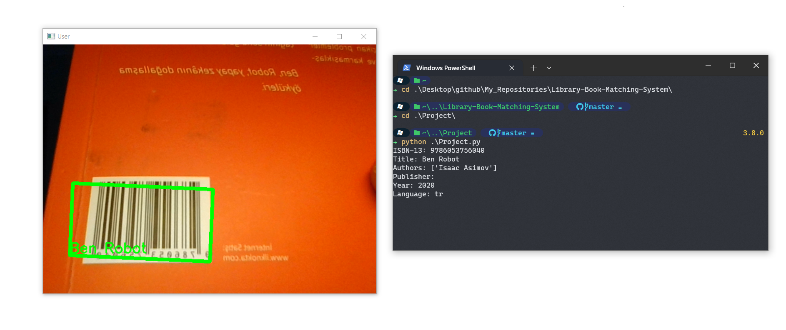

# Library Book Matching System

***(Will be updated)***

## Overview

This project is a library book matching system developed for a personal project. The aim of the project is to create an efficient and secure library experience by matching books' ISBN codes using barcode recognition and a SQLite database.

The system consists of a barcode recognition system that can read ISBN codes and retrieve information about the corresponding book, such as its title and author.

## Usage

- To use the system, you will need to install the necessary dependencies and run the code.

- The system requires Python 3.8 or higher, as well as the dependencies listed in the requirements.txt file. 

**You can install these dependencies using pip by running the following commands:**

1. Install the required dependencies listed in the requirements.txt file. Use the following command:
```bash
pip install -r requirements.txt
```

2. Direct to Project directory and execute the program with the following command:
```bash
cd Project
python Project.py
```

The system will launch and prompt you to scan a book's ISBN code 
using the barcode scanner. Follow the instructions provided by the system to retrieve information about the book.

## Sample Image



## Directory Structure

```
Library-Book-Matching-System
├── classes
│   └── book.py
├── database
│   ├── __init__.py
│   ├── BookDB.py
│   └── SQLiteDB.py
├── images
│   └── Project-Sample.png
├── methods
│   └── methods.py
├── Sub-Algorithms
│   ├── Barcode-Detection
│   ├── Barcode-to-ISBN
│   ├── Face-Detection
│   └── Yolo
│       ├── Yolo-320
│       └── Yolo-Tiny
├── tests
│   ├── __init__.py
│   └── test_SQLiteDB.py
├── .gitignore
├── __init__.py
├── books.db
├── Project.py
├── README.md
└── requirements.txt
```

## Future Work

Although this project is currently focused on barcode recognition for ISBN codes, there is potential for further development. Some ideas for future enhancements include:

- Integrating the system with existing library management software to improve the borrowing and return process
- Adding more features to the system, such as recommendations based on a user's borrowing history